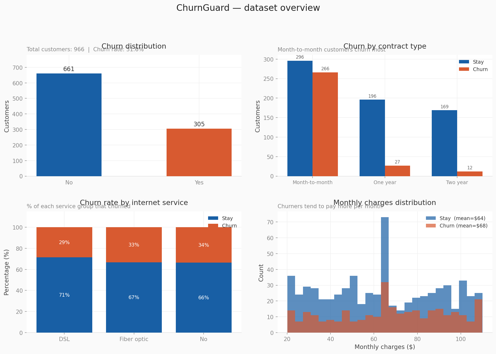
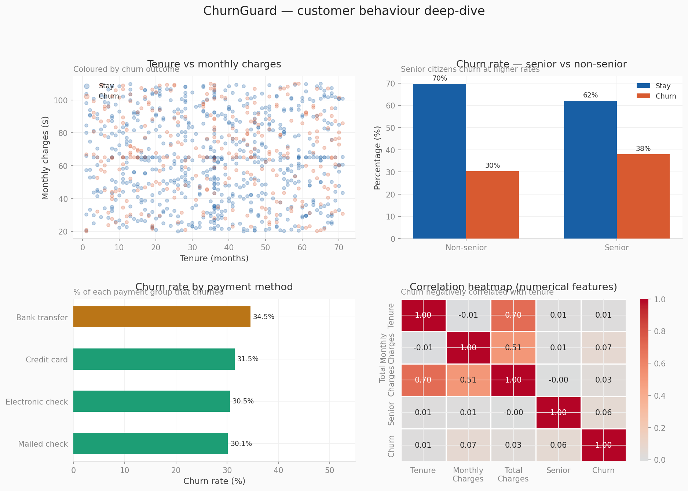
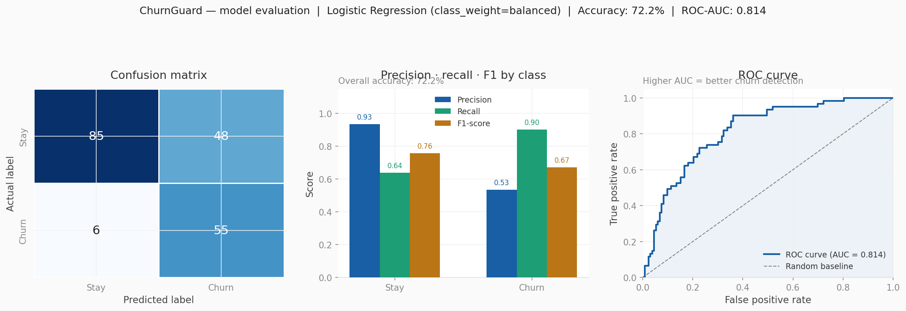

# ChurnGuard — Customer Churn Prediction


A complete end-to-end Machine Learning pipeline to predict customer churn for a telecom company. Built as part of the IIT Patna AIML Program (Masai School) Mini Project 2.

---

## Problem Statement

Customer churn — when a customer stops using a service — is one of the most costly problems in the telecom industry. The goal of this project is to:
- Identify patterns in customer behaviour that lead to churn
- Build a machine learning model to predict whether a customer will churn
- Provide actionable risk-level outputs for retention teams

---

## Project Structure
mini_project-2/
│
├── DataSet/
│   ├── churnguard_data.csv       # Raw dataset (1030 rows, messy real-world data)
│   └── cleaned_data.csv          # Cleaned dataset (generated by Task 2)
│
├── Project_2/
│   ├── Task1_load_explore.py     # Load and explore raw data
│   ├── task2_clean_data.py       # Clean data and save cleaned_data.csv
│   ├── task3_train_model.py      # Train and compare ML models
│   ├── task4_predict.py          # Predict churn for a new customer
│   └── task5_visualize.py        # Generate dashboard visualizations
│
├── Dashboard/
│   ├── task5_fig1_overview.png   # Dataset overview charts
│   ├── task5_fig2_behaviour.png  # Customer behaviour deep-dive
│   └── task5_fig3_model.png      # Model evaluation (ROC curve, confusion matrix)
│
└── README.md
---

## Dataset Overview

| Property | Value |
|----------|-------|
| Raw rows | 1030 |
| Columns | 12 |
| Cleaned rows | 966 |
| Churn rate | 31.6% |
| Missing values (raw) | 205 cells |

**Data quality issues found and fixed:**
- Mixed casing in Churn, PhoneService, PaperlessBilling (`YES`, `yes`, `yEs`)
- Contract typos (`month to month`, `Monthly`, `1 year`)
- InternetService variants (`FiberOptic`, `Fibre optic`, `DSl`)
- Leading/trailing whitespace in PaymentMethod and gender
- TotalCharges stored as string instead of numeric
- Negative and zero tenure values
- MonthlyCharges outliers (max = $1500, valid range $10–$200)
- 30 duplicate rows

---

## Pipeline — How to Run

> **Important:** Always run Task 2 before Tasks 3, 4, and 5. It generates `cleaned_data.csv` which all subsequent tasks depend on.

```bash
# Navigate to the Project_2 folder
cd Project_2

# Task 1 — Explore raw data
python Task1_load_explore.py

# Task 2 — Clean data (generates cleaned_data.csv)
python task2_clean_data.py

# Task 3 — Train and compare models
python task3_train_model.py

# Task 4 — Predict churn for a new customer (interactive)
python task4_predict.py

# Task 5 — Generate dashboard visualizations
python task5_visualize.py
```

---

## Task Descriptions

### Task 1 — Load & Explore
- Loads raw CSV and inspects shape, dtypes, missing values, duplicates
- Prints `df.describe()` for numerical summary
- Lists all unique values in messy columns (Churn, Contract, InternetService, PaymentMethod)
- Summarises 8 data quality issues found

### Task 2 — Clean Data
- Drops `customerID` (non-feature column)
- Removes 30 duplicate rows
- Strips whitespace from all string columns
- Standardises casing for Churn, PhoneService, PaperlessBilling, gender
- Fixes Contract variants → `Month-to-month / One year / Two year`
- Fixes InternetService variants → `DSL / Fiber optic / No`
- Converts TotalCharges to numeric
- Removes invalid tenure (≤ 0) and outlier MonthlyCharges (< $10 or > $200)
- Imputes missing values (mean for MonthlyCharges/TotalCharges, median for tenure)
- Saves `cleaned_data.csv`

### Task 3 — Train Model
- Loads `cleaned_data.csv`
- One-hot encodes all categorical features
- Stratified 80/20 train-test split
- Trains and compares two models:
  - Logistic Regression (`class_weight='balanced'`)
  - Random Forest (`class_weight='balanced'`)
- Evaluates using Accuracy, ROC-AUC, Precision, Recall, F1
- 5-Fold Stratified Cross-Validation for robust evaluation

### Task 4 — Predict
- Trains Logistic Regression on full cleaned dataset
- Takes interactive user input (tenure, charges, contract type, etc.)
- Outputs churn probability % and risk level (High / Moderate / Low)

### Task 5 — Visualize
Generates 3 figures saved to `Dashboard/`:
- **Figure 1** — Dataset overview (churn distribution, contract breakdown, internet service %, monthly charges histogram)
- **Figure 2** — Behaviour deep-dive (tenure vs charges scatter, senior citizen analysis, payment method churn rates, correlation heatmap)
- **Figure 3** — Model evaluation (confusion matrix, precision/recall/F1 bar chart, ROC curve)

---

## Results

| Model | Accuracy | ROC-AUC | CV ROC-AUC |
|-------|----------|---------|------------|
| Logistic Regression | 72.2% | **0.814** | 0.704 |
| Random Forest | 71.7% | 0.759 | 0.662 |

**Winner: Logistic Regression**

Key metrics for churn detection:
- Churn Recall: **90%** (catches 9 out of 10 churners)
- Churn Precision: 53%
- ROC-AUC: **0.814**

---

## Dashboard

### Figure 1 — Dataset Overview


### Figure 2 — Customer Behaviour Deep-Dive


### Figure 3 — Model Evaluation


---

## Key Insights

- **Month-to-month** contract customers churn the most
- **Fiber optic** internet service has the highest churn rate (~33%)
- **Electronic check** payment method has the highest churn rate (~40%)
- **Senior citizens** churn at significantly higher rates than non-seniors
- Customers with **shorter tenure** are far more likely to churn
- **Higher monthly charges** are associated with higher churn risk

---

## Tech Stack

| Library | Purpose |
|---------|---------|
| `pandas` | Data loading, cleaning, manipulation |
| `scikit-learn` | ML models, scaling, evaluation |
| `matplotlib` | Custom visualizations |
| `seaborn` | Heatmap, statistical plots |
| `numpy` | Numerical operations |

---

## Author

**Jagannati Harshavardhan**  
B.Tech AIML — IIT Patna Program (Masai School)  
GitHub: [J-harshavardhan](https://github.com/J-harshavardhan)
